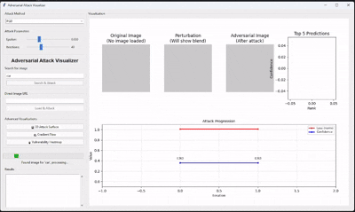
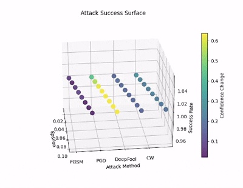

# Adversarial Attack Visualizer

A comprehensive GUI application for visualizing and understanding adversarial attacks on deep neural networks.


**Attack Progression**



**Attack Surface Visualization**


## Features

### Attack Methods
- FGSM (Fast Gradient Sign Method)
- PGD (Projected Gradient Descent)
- DeepFool (Minimal perturbation attack)
- C&W (Carlini & Wagner attack)

### Visualizations
- Real-time attack progression tracking
- Side-by-side original vs adversarial image comparison
- Enhanced perturbation visualization (10x amplified)
- Top 5 prediction confidence analysis
- 3D attack surface mapping
- Gradient flow visualization
- Vulnerability heatmaps

### Image Sources
- Pexels API integration for image search
- Unsplash fallback support
- Direct URL image loading
- Automatic fallback to dummy images (optional)

## Installation

### Prerequisites
- Python 3.8 or higher
- CUDA-compatible GPU (optional, but recommended)

### Setup
```bash
git clone https://github.com/yourusername/adversarial-attack-visualizer.git
cd adversarial-attack-visualizer
pip install -r requirements.txt
cp .env.example .env
```
Edit `.env` and insert your Pexels API key.

## Usage

### Quick Start
```bash
python scripts/run_attack.py
```

### Test Installation
```bash
python test_setup.py
```

## Configuration

### Environment Variables
```
PEXELS_API_KEY=your_pexels_api_key_here
```

### Attack Parameters
- Epsilon: Perturbation magnitude (0.001 - 0.1)
- Iterations: Number of attack iterations (10 - 100)
- Attack Method: FGSM, PGD, DeepFool, or C&W

## Project Structure
```
adversarial-attack-visualizer/
├── scripts/
│   └── run_attack.py
├── attacks/
│   ├── fgsm.py
│   ├── pgd.py
│   ├── deepfool.py
│   └── cw.py
├── utils/
│   ├── image_utils.py
│   └── visualization.py
├── requirements.txt
├── test_setup.py
├── .env.example
├── .gitignore
└── README.md
```

## Examples

### Basic Attack
1. Launch the application
2. Enter search term (e.g., "cat", "dog", "car")
3. Select attack method
4. Adjust parameters using sliders
5. Click "Search & Attack"

### Advanced Visualizations
- 3D Attack Surface: Compare attack effectiveness across methods and parameters
- Gradient Flow: Visualize gradient magnitudes during attacks
- Vulnerability Heatmap: Identify most vulnerable image regions

## Technical Details

### Model
- Architecture: ResNet-18
- Dataset: ImageNet pretrained
- Input Size: 224x224 RGB
- Normalization: ImageNet standard (mean=[0.485, 0.456, 0.406], std=[0.229, 0.224, 0.225])

### Attack Implementations
- FGSM: Single-step gradient-based attack
- PGD: Multi-step projected gradient descent with momentum
- DeepFool: Iterative minimal perturbation method
- C&W: Optimization-based attack with L2 norm constraints

## Contributing

1. Fork the repository
2. Create a feature branch (`git checkout -b feature/your-feature`)
3. Commit your changes (`git commit -m 'Add feature'`)
4. Push to your branch (`git push origin feature/your-feature`)
5. Open a Pull Request

## License

This project is licensed under the MIT License. See the LICENSE file for details.

## Acknowledgments

- PyTorch team for the deep learning framework
- ImageNet dataset contributors
- Pexels and Unsplash for image APIs
- Researchers behind adversarial methods

## Citation

```bibtex
@software{adversarial_attack_visualizer,
  title={Adversarial Attack Visualizer},
  author={Your Name},
  year={2025},
  url={https://github.com/yourusername/adversarial-attack-visualizer}
}
```

## Troubleshooting

### Common Issues

- CUDA out of memory: Reduce batch size or switch to CPU
- Missing dependencies: Run `pip install -r requirements.txt`
- API key errors: Check `.env` file
- Slow performance: Use GPU acceleration

### Getting Help

- Open a GitHub issue
- Search existing issues
- Review documentation and logs

## Roadmap

- Support for additional attacks (e.g., JSMA, BIM)
- Custom model uploads
- Batch attack support
- Export result capability
- Performance benchmarking
