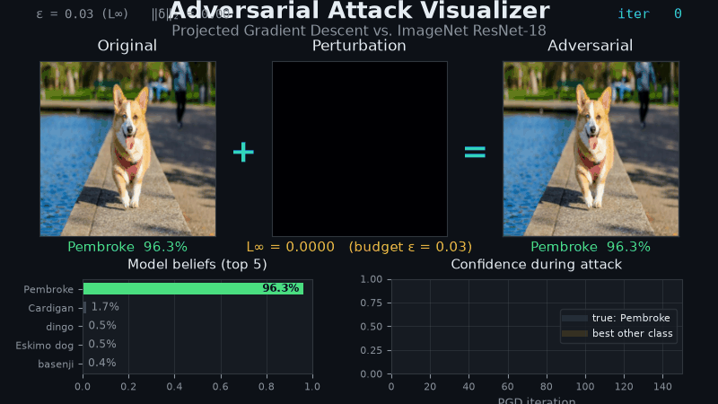

# Adversarial Attack Visualizer

Interactive GUI for running and visualizing adversarial attacks — FGSM, PGD,
DeepFool, and Carlini & Wagner — against a pretrained ImageNet ResNet-18.




*A PGD attack collapsing a 92% "Pembroke Welsh corgi" prediction while the
perturbation stays within an L∞ budget of 0.03.
([MP4 version](docs/assets/demo.mp4))*

## Features

- **Four attacks** — FGSM, PGD (momentum + random start), DeepFool, C&W —
  all operating in [0, 1] pixel space, so ε is in true pixel units
- **Live visualization** — original / perturbation / adversarial panels,
  top-5 predictions with class names, per-iteration confidence and loss
- **Extras** — 3D attack-surface sweep, gradient magnitude view,
  perturbation heatmap, L2/L∞ metrics, PNG/PDF export
- **Any image** — keyword search (optional Pexels API key), URL, or local file

## Quick Start

```bash
git clone https://github.com/imjbassi/adversarial-visualizer.git
cd adversarial-visualizer
pip install -r requirements.txt
python scripts/run_attack.py
```

Verify the setup (offline, tests every attack): `python test_setup.py`

Optional: `cp .env.example .env` and add a Pexels API key for image search.

## Programmatic Use

```python
from attacks import pgd_attack
from utils.model_utils import load_model, build_transform

model, categories = load_model()
x = build_transform()(pil_image).unsqueeze(0)   # [0, 1] pixel space
label = model(x).argmax(dim=1)
x_adv = pgd_attack(model, x, label, epsilon=0.03, iters=40)
```

Render a demo video from any image:

```bash
pip install imageio imageio-ffmpeg
python scripts/make_demo_video.py --image photo.jpg --out demo.mp4
```

## Project Structure

```
attacks/     FGSM, PGD, DeepFool, C&W implementations
utils/       model wrapper (normalization inside forward), image loading
scripts/     run_attack.py (GUI), make_demo_video.py (demo renderer)
```

## Responsible Use

For education and robustness research on models you own or are authorized to
test.

## License

MIT — see [LICENSE](LICENSE).
