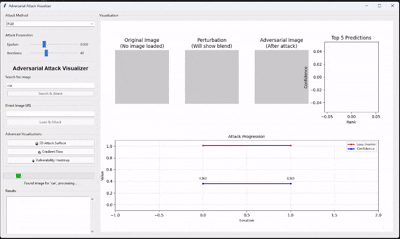
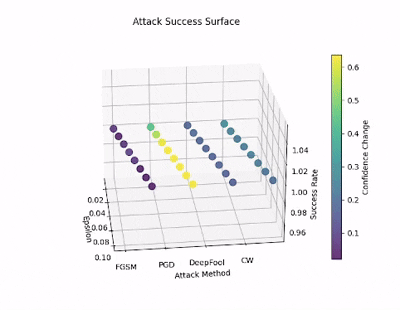

# Adversarial Attack Visualizer

An interactive GUI for running and visualizing adversarial attacks (FGSM, PGD,
DeepFool, Carlini & Wagner) against a pretrained ResNet-18 — a hands-on way to
explore the robustness of deep neural networks.


## Demo

A PGD attack collapsing ResNet-18's 96% "Pembroke Welsh corgi" prediction —
generated with `scripts/make_demo_video.py`:


Higher-quality MP4: [docs/assets/demo.mp4](docs/assets/demo.mp4)

Render your own from any image:

```bash
pip install imageio imageio-ffmpeg
python scripts/make_demo_video.py --image path/or/url.jpg --out demo.mp4
```

**Attack Progression**



**Attack Surface Visualization**



## Features

### Attack Methods
- **FGSM** — Fast Gradient Sign Method (single-step, L∞)
- **PGD** — Projected Gradient Descent with momentum and random start (L∞)
- **DeepFool** — iterative minimal-perturbation attack (L2)
- **C&W** — Carlini & Wagner optimization-based attack (L2, tanh-space)

All attacks operate in [0, 1] pixel space (normalization happens inside the
model wrapper), so the epsilon budget is expressed in true pixel units and
perturbed images remain valid images.

### Visualizations
- Live attack progression (loss and confidence per iteration)
- Side-by-side original vs. adversarial comparison with human-readable
  ImageNet class names
- Enhanced perturbation view (10× amplified)
- Top-5 prediction confidence for the adversarial image
- 3D attack-surface sweep across methods and epsilon values
- Input-gradient magnitude ("gradient flow") view
- Perturbation-magnitude heatmap
- L2 / L∞ perturbation norms in the results panel

### Image Sources
- Pexels API search (optional; needs a free API key)
- Direct image URL loading
- Local image files
- Random placeholder photos as a fallback when no API key is set

### Export
- Save the full results figure (PNG / PDF / SVG)
- Save the adversarial image as PNG

## Installation

### Prerequisites
- Python 3.8+ with tkinter (bundled on Windows/macOS; on Linux install your
  distro's `python3-tk` package)
- CUDA GPU optional — everything runs on CPU too

### Setup
```bash
git clone https://github.com/imjbassi/adversarial-visualizer.git
cd adversarial-visualizer
pip install -r requirements.txt
cp .env.example .env   # optional: add your Pexels API key for image search
```

## Usage

```bash
python scripts/run_attack.py
```

Verify your setup (runs offline, tests every attack against a small model):

```bash
python test_setup.py
```

### Basic Workflow
1. Pick an attack method and adjust epsilon / iterations with the sliders
2. Load an image — search by keyword, paste a URL, or open a local file
3. Inspect the results: predictions, perturbation, attack progression
4. Optionally export the figure or the adversarial image

## Configuration

```
PEXELS_API_KEY=your_key_here   # optional, in .env
```

Without a key, keyword search falls back to random placeholder photos;
URL and local-file loading are unaffected.

### Attack Parameters
- **Epsilon** — L∞ perturbation budget in pixel units (0.001–0.1;
  0.03 ≈ 8/255, a common benchmark budget)
- **Iterations** — attack iterations for PGD / DeepFool / C&W (10–100)

## Project Structure
```
adversarial-visualizer/
├── attacks/            # Attack implementations (importable as a package)
│   ├── fgsm.py
│   ├── pgd.py
│   ├── deepfool.py
│   └── cw.py
├── utils/
│   ├── model_utils.py  # NormalizedModel wrapper, model/class-name loading
│   └── image_utils.py  # Image search, download, and file loading
├── scripts/
│   └── run_attack.py   # Tkinter GUI
├── test_setup.py       # Offline system test
├── requirements.txt
└── .env.example
```

### Using the attacks programmatically
```python
import torch
from attacks import pgd_attack
from utils.model_utils import load_model, build_transform

model, categories = load_model()
x = build_transform()(pil_image).unsqueeze(0)   # [0, 1] pixel space
label = model(x).argmax(dim=1)
x_adv = pgd_attack(model, x, label, epsilon=0.03, iters=40)
print(categories[model(x_adv).argmax(dim=1).item()])
```

## Technical Details

- **Model:** ResNet-18, ImageNet-pretrained, 224×224 RGB input
- **Normalization:** applied inside the model wrapper
  (`utils.model_utils.NormalizedModel`), so attacks see raw pixels
- **FGSM:** `x + ε·sign(∇ₓL)`, clipped to [0, 1]
- **PGD:** momentum iterative FGSM (MI-FGSM style) with random start and
  per-step projection into the ε-ball
- **DeepFool:** linearized nearest-boundary steps over the top-k candidate
  classes (fast even with 1000 classes)
- **C&W:** Adam optimization in tanh space, tracking the lowest-L2
  successful adversarial

## Responsible Use

This tool is for education and robustness research on models you own or are
authorized to test. Adversarial examples demonstrate why deployed ML systems
need robustness evaluation and defenses.

## License

MIT — see [LICENSE](LICENSE).

## Acknowledgments

- Goodfellow et al., *Explaining and Harnessing Adversarial Examples* (FGSM)
- Madry et al., *Towards Deep Learning Models Resistant to Adversarial Attacks* (PGD)
- Moosavi-Dezfooli et al., *DeepFool*
- Carlini & Wagner, *Towards Evaluating the Robustness of Neural Networks*
- PyTorch / torchvision, Pexels

## Roadmap

- Additional attacks (JSMA, BIM, AutoAttack)
- Custom model uploads
- Batch attack evaluation
- Simple defenses (JPEG compression, median filtering) for comparison
